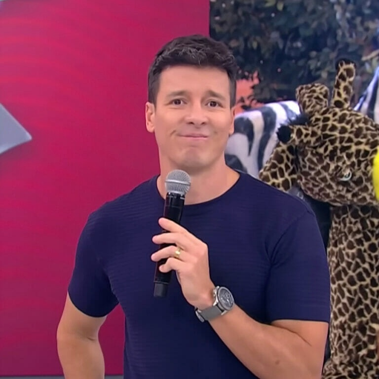

<h1 align="center">
  
</h1>

<h1 align="center">Rodrigo Bot</h4>
<p align="center">
  
  <a href="https://www.linkedin.com/in/fellipeutaka/">
    
  </a>
  <a href="https://github.com/fellipeutaka/rodrigo-bot/commits/main">
    
  </a>
  
  <a href="https://github.com/fellipeutaka/rodrigo-bot/stargazers">
    
  </a>
</p>

<p align="center">
  <a href="#-project">Project</a> |
  <a href="#-technologies">Technologies</a> |
  <a href="#ℹ%EF%B8%8F-how-to-use">How to use</a> |
  <a href="#-how-to-contribute">How to contribute</a> |
  <a href="#-license">License</a>
</p>

## 💻 Project

A Discord bot that plays random "Vai dar namoro" sounds. "Vai dar namoro" (It's going to date) is a special segment presented and directed by Rodrigo Faro in the program Hora do Faro (a brazilian television program).

## 🚀 Technologies

This project was developed with the following technologies:

- [TypeScript][ts]
- [discord.js][discord.js]
- [Babel][babel]
- [ESLint][eslint]
- [Prettier][prettier]

## ℹ️ How To Use

To clone and run this application, first you need to create a [Discord Bot](https://www.androidpolice.com/how-to-make-discord-bot/). Afterwards, you will need [Git][git] and [Node.js][node] installed on your computer.

From your command line:

```bash
# Clone this repository
$ git clone https://github.com/fellipeutaka/cook.git

# Install dependencies
# If you are using NPM
$ npm install

# If you are using Yarn
$ yarn install

# If you are using PNPM (current package manager)
$ pnpm install
```

After that, copy and paste the .env.example file and rename it to .env.
Then insert your Discord Token and Discord Client ID. Great! Now you just need to start the development server.

```bash
# Start server
# If you are using NPM
$ npm run dev

# If you are using Yarn
$ yarn dev

# If you are using PNPM (current package manager)
$ pnpm dev
```

## 🤔 How to contribute

1. Fork this repository.
2. Create a branch: `git checkout -b <branch_name> `.
3. Make your changes and commit them: `git commit -m '<commit_message> '`
4. Push to original branch:`git push origin <project_name> / <local>`
5. Create the pull request. Or, see the GitHub documentation on [how to create a pull request][pr].

## 📝 License

This project is under the MIT license. See the [LICENSE](https://github.com/fellipeutaka/rodrigo-bot/blob/main/LICENSE.md) for details.

Made with ♥ by Fellipe Utaka 👋 [Get in touch!](https://www.linkedin.com/in/fellipeutaka/)

[pr]: https://help.github.com/en/github/collaborating-with-issues-and-pull-requests/creating-a-pull-request
[git]: https://git-scm.com
[node]: https://nodejs.org/
[ts]: https://www.typescriptlang.org/
[discord.js]: https://discord.js.org/
[babel]: https://babeljs.io/
[eslint]: https://eslint.org/
[prettier]: https://prettier.io/
